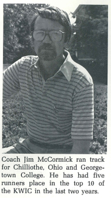
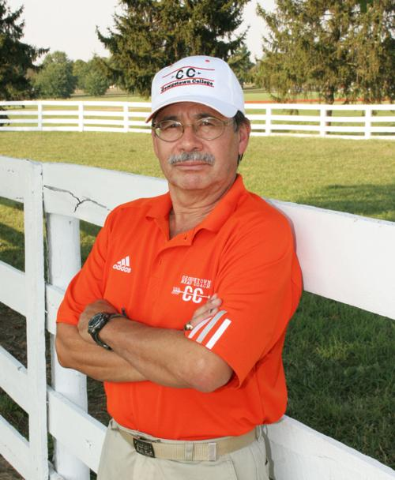
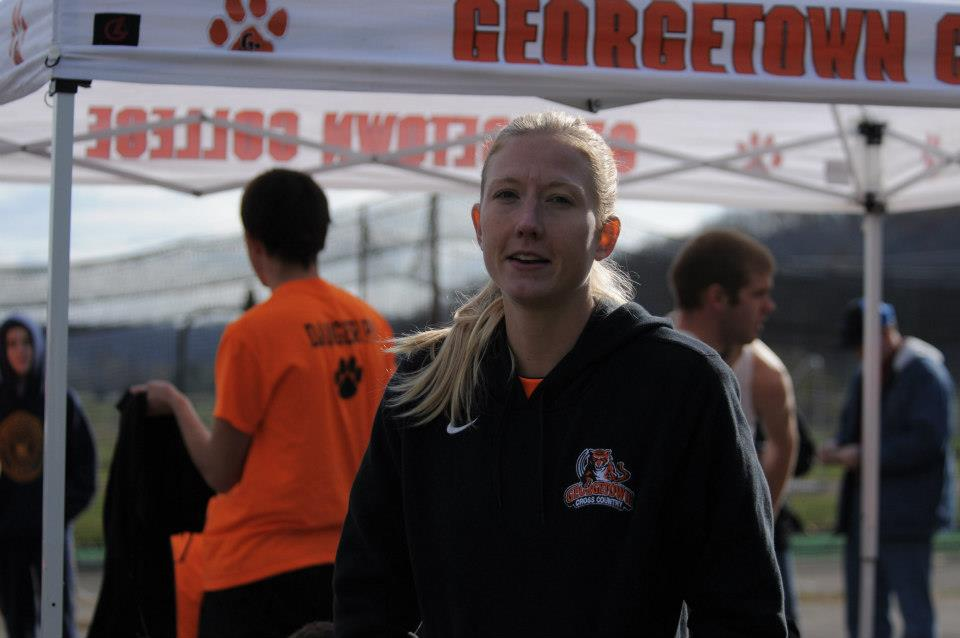
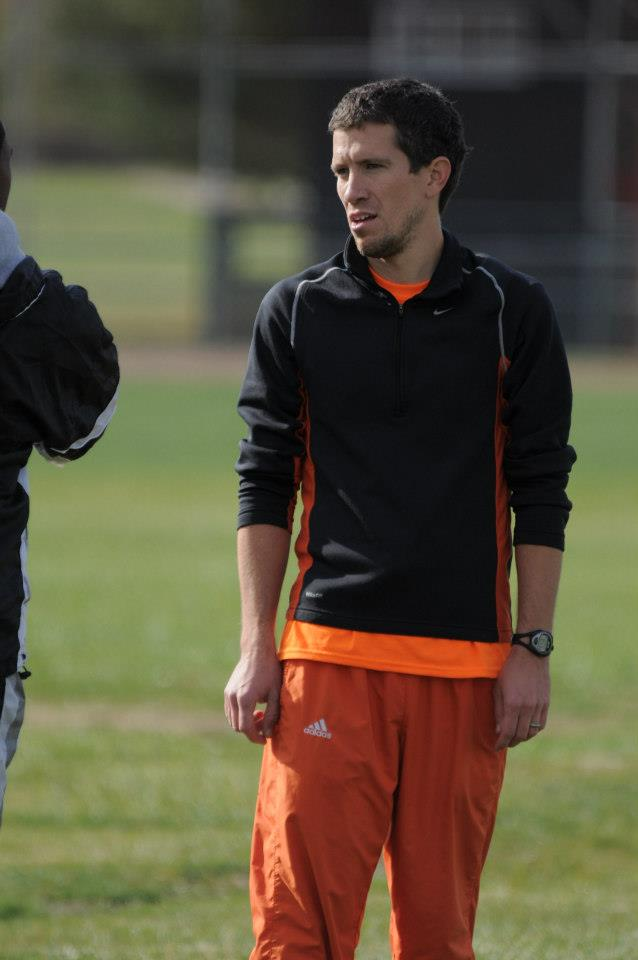

```{r include=FALSE}
require(knitr)
require(mosaic)
require(DT)
require(kableExtra)
library(xtable)
library(readxl)
library(rJava)
library(xlsx)
library(googlesheets4)
library(ggplot2)

history <- read_sheet("https://docs.google.com/spreadsheets/d/1QHzJYKRBgV-yQtBsh1UF5412YH71o__I7tq_tC58380/edit?usp=sharing")
```

# Menu {.tabset .tabset-fade .tabset-pills}

## All Time List

Coming Soon!

## Year by Year {.tabset .tabset-fade .tabset-pills}

```{r echo=FALSE, results="asis"}
years <- unique(history$Year)
length <- length(years)

for(i in 1:length){
  
  cat("### ", years[i], " {.tabset .tabset-fade .tabset-pills}","\n")
  cat("\n")
  cat("\n")
  cat("#### Roster","\n")
  cat("\n")
  cat("\n")
  cat("Coming Soon!")
  cat("\n")
  cat("\n")
  cat("#### Results","\n")
  cat("\n")
  cat("\n")
  cat("Coming Soon!")
  cat("\n")
  cat("\n")
  cat("#### Summary","\n")
  cat("\n")
  cat("\n")
  cat("Coming Soon!","\n")
  cat("\n")
  cat("\n")
  cat("#### Awards","\n")
  cat("\n")
  cat("\n")
  cat("Coming Soon!","\n")
  cat("\n")


}
```

## Coaches

### Jim McCormick (1981-1991)

<center>

</center>

### Beverly Lathrop (1992)

### Angie Sanders (1993)

### Rick Crump (1994-1995)

### Abe Padilla (1996-2007)

<center>

</center>

### Kevin Calhoun (2008-2009)

### Betsy Laski (Women's Coach: 2010-2012)

<center>

</center>

### Todd McDaniel (Men's Coach: 2010-2012, 2013-2014)

<center>

</center>

### Luke Garnett (2015-Present)